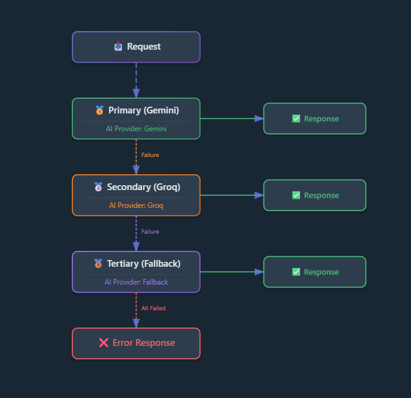
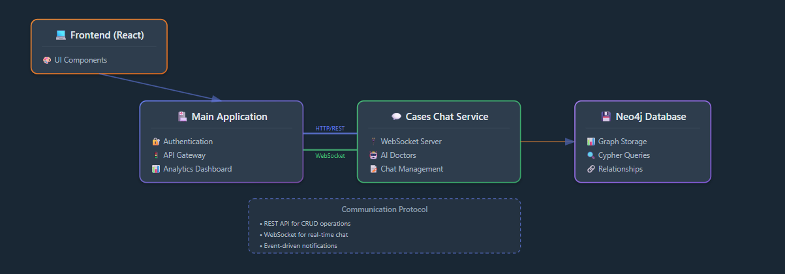

# Cases Chat Microservice

## 🏥 Overview

The Cases Chat microservice is a sophisticated AI-powered medical consultation system that enables real-time, multi-doctor consultations for medical cases. It provides a WebSocket-based real-time chat interface, integrates with multiple AI providers (Gemini, Groq, etc.), and maintains comprehensive case management with persistent storage in Neo4j graph database.

## 📋 Table of Contents
- [Architecture Overview](#architecture-overview)
- [Core Features](#core-features)
- [Database Schema](#database-schema)
- [System Workflows](#system-workflows)
- [API Endpoints](#api-endpoints)
- [WebSocket Communication](#websocket-communication)
- [Service Components](#service-components)
- [Integration Points](#integration-points)
- [Configuration](#configuration)
- [Error Handling](#error-handling)
- [Health Monitoring](#health-monitoring)

## 🏗️ Architecture Overview


### Directory Structure

```
cases_chat/
├── agents/               # Agent-based services
│   ├── case_numbering_agent.py
│   ├── chat_history_agent.py
│   ├── doctor_consultation_agent.py
│   └── mcp_integration_agent.py
├── api/                  # API routes
│   └── routes/
│       ├── cases.py
│       ├── chat.py
│       ├── doctors.py
│       └── websocket.py
├── core/                 # Core utilities
│   ├── config.py
│   ├── database/
│   ├── dependencies.py
│   ├── exceptions.py
│   └── websocket_manager.py
├── mcp_server/          # MCP server integration
│   ├── mcp_client.py
│   └── medical_history_service.py
├── migrations/          # Database migrations
│   └── migration_runner.py
├── models/              # Data models
│   ├── case_models.py
│   ├── chat_models.py
│   └── doctor_models.py
├── prompts/             # AI doctor prompts
│   ├── bp_specialist_prompt.py
│   ├── cardiologist_prompt.py
│   └── general_consultant_prompt.py
├── services/            # Business logic
│   ├── case_management/
│   ├── chat/
│   ├── doctors/
│   ├── media/
│   └── storage/
└── main.py              # Application entry point
```

## ✨ Core Features

### 1. **Multi-AI Doctor System**
- **Three Specialized AI Doctors**:
  - General Consultant (Dr. Sarah Chen) - Primary care and triage
  - Cardiologist (Dr. Michael Reynolds) - Cardiovascular specialist
  - BP Specialist (Dr. Priya Patel) - Hypertension management

### 2. **Case Management**
- Create, update, and manage medical cases
- Automatic case numbering system (format: CASE-YYYY-NNNNNN)
- Priority-based case handling (LOW, MEDIUM, HIGH, CRITICAL)
- Case status tracking (ACTIVE, CLOSED, ARCHIVED, PENDING)

### 3. **Real-time Chat System**
- WebSocket-based bidirectional communication
- Multi-user support per case
- Typing indicators and presence management
- Message ordering and synchronization

### 4. **Multi-Modal Support**
- Text chat with context preservation
- Image analysis for medical images
- Audio transcription for voice messages
- Media file validation and storage

### 5. **Advanced Features**
- Doctor handover with context preservation
- Automatic fallback mechanism for high availability
- Case similarity search
- Comprehensive case report generation
- MCP server integration for medical history

## 💾 Database Schema

### Neo4j Graph Database Structure


## 🔄 System Workflows

### 1. Case Creation Workflow


### 2. Chat Message Processing Workflow


### 3. Doctor Fallback Mechanism



## Setup

### 1. Environment Variables

Create a `.env` file with:

```env
# Service Configuration
SERVICE_NAME=CasesChat
SERVICE_VERSION=1.0.0
ENVIRONMENT=production
API_HOST=0.0.0.0
API_PORT=8000

# Database
NEO4J_URI=bolt://localhost:7687
NEO4J_USER=neo4j
NEO4J_PASSWORD=password

# AI Providers
DEFAULT_AI_PROVIDER=gemini
ENABLE_DOCTOR_FALLBACK=true
GEMINI_API_KEY=your-gemini-api-key
GROQ_API_KEY=your-groq-api-key

# Models
VISION_MODEL=llama-3.2-90b-vision-preview
WHISPER_MODEL=whisper-large-v3

# MCP Server
MCP_SERVER_ENABLED=true
MCP_SERVER_PORT=3001

# WebSocket Configuration
WS_HEARTBEAT_INTERVAL=30
WS_CONNECTION_TIMEOUT=300
```

### 2. Start Services

#### Option 1: With MCP Server (Recommended)
```bash
python start_with_mcp.py
```

#### Option 2: Without MCP Server
```bash
python app/main.py
```

## 📡 API Endpoints

### Cases Management

| Method | Endpoint | Description |
|--------|----------|-------------|
| POST | `/api/v1/cases` | Create new medical case |
| GET | `/api/v1/cases/{case_id}` | Get case details |
| PUT | `/api/v1/cases/{case_id}` | Update case |
| DELETE | `/api/v1/cases/{case_id}` | Delete case |
| GET | `/api/v1/cases/user/{user_id}` | Get user's cases |
| POST | `/api/v1/cases/{case_id}/close` | Close case |

#### Create Case Example
```http
POST /api/v1/cases
Authorization: Bearer <token>

{
  "chief_complaint": "Chest pain",
  "symptoms": ["chest pain", "shortness of breath"],
  "patient_age": 45,
  "patient_gender": "Male",
  "past_medical_history": "Hypertension",
  "current_medications": "Lisinopril",
  "allergies": "None",
  "priority": "high"
}
```

### Chat Operations

| Method | Endpoint | Description |
|--------|----------|-------------|
| POST | `/api/v1/chat/{case_id}/message` | Send message |
| GET | `/api/v1/chat/{case_id}/history` | Get chat history |
| POST | `/api/v1/chat/{case_id}/handover` | Doctor handover |
| GET | `/api/v1/chat/{case_id}/session` | Get session info |

#### Send Message Example
```http
POST /api/v1/chat/{case_id}/message
Authorization: Bearer <token>
Content-Type: multipart/form-data

message: "I have chest pain"
doctor_type: "general_consultant" | "cardiologist" | "bp_specialist"
session_id: <optional>
image: <optional image file>
audio: <optional audio file>
```

### Doctor Management

| Method | Endpoint | Description |
|--------|----------|-------------|
| GET | `/api/v1/doctors` | List available doctors |
| GET | `/api/v1/doctors/{doctor_type}/status` | Get doctor status |
| POST | `/api/v1/doctors/select` | Select doctor for case |

### Media Operations

| Method | Endpoint | Description |
|--------|----------|-------------|
| POST | `/api/v1/media/upload` | Upload media file |
| GET | `/api/v1/media/{media_id}` | Get media file |
| DELETE | `/api/v1/media/{media_id}` | Delete media file |

## 🔌 WebSocket Communication

### Connection

```
ws://[host]:[port]/api/v1/ws/connect/{case_id}?user_id={user_id}
```

### Message Types

```json
// User Message
{
  "type": "user_message",
  "content": "Patient has chest pain",
  "metadata": {
    "timestamp": "2024-01-01T00:00:00Z"
  }
}

// Doctor Response
{
  "type": "doctor_response",
  "content": "Based on the symptoms...",
  "doctor_type": "cardiologist",
  "confidence_score": 0.95,
  "metadata": {}
}

// Typing Indicator
{
  "type": "typing_indicator",
  "user_id": "ai_doctor",
  "is_typing": true
}

// System Notification
{
  "type": "system_notification",
  "content": "New doctor joined the consultation",
  "severity": "info"
}

// Error Message
{
  "type": "error_message",
  "error": "SERVICE_UNAVAILABLE",
  "message": "Failed to process request"
}
```

## ⚙️ Service Components

### 1. **Case Service**
- Manages case lifecycle (creation, updates, closure)
- Generates unique case numbers (CASE-YYYY-NNNNNN format)
- Handles case status transitions
- Validates case data

### 2. **Message Processor**
- Processes incoming chat messages
- Manages conversation context (last 10 messages)
- Coordinates with AI doctors
- Handles message ordering and synchronization

### 3. **Doctor Coordinator**
- Manages multiple AI doctor services
- Implements fallback mechanisms (Primary → Secondary → Tertiary)
- Tracks service performance metrics
- Load balancing between providers

### 4. **Storage Service**
- Neo4j graph database integration
- Connection pooling (50 connections max)
- Transaction management with retry logic
- Data persistence and retrieval

### 5. **WebSocket Manager**
- Real-time connection management
- Message broadcasting to case participants
- Heartbeat monitoring (30s interval)
- Connection lifecycle management

### 6. **Media Handler**
- File upload/download management
- Format validation (images, audio)
- Storage management
- Media processing (resizing, transcription)

## 🔗 Integration Points

### 1. Main Application Integration



### 2. AI Service Integration

- **Gemini AI**: Primary AI provider for medical consultations
- **Groq AI**: Secondary provider with specialized models
- **Fallback Chain**: Automatic switching on service failure

### 3. MCP Server Integration

The MCP (Model Context Protocol) server provides:
- Medical history retrieval
- External knowledge base queries
- Clinical decision support
- Case pattern analysis

#### MCP Capabilities
- `search_cases` - Search user's medical history
- `get_case_history` - Retrieve complete case details
- `find_similar_cases` - Find similar medical cases
- `get_case_timeline` - Patient's medical timeline
- `analyze_patterns` - Medical pattern analysis

### 4. Knowledge Graph Integration

- Medical entity extraction
- Relationship mapping
- Semantic search capabilities
- Pattern recognition

## 👨‍⚕️ Doctor Profiles

### General Consultant (Dr. Sarah Chen)
- Holistic primary care approach
- Comprehensive history taking
- Triage and referral decisions
- Preventive care focus

### Cardiologist (Dr. Michael Reynolds)
- Cardiovascular risk assessment
- Cardiac symptom analysis
- Evidence-based cardiac care
- Lifestyle modification guidance

### BP Specialist (Dr. Priya Patel)
- Blood pressure pattern analysis
- Medication optimization
- Lifestyle interventions
- Secondary hypertension screening

## ❌ Error Handling

### Error Categories

1. **Service Errors**
   - `DOCTOR_SERVICE_ERROR`: AI service failures
   - `STORAGE_ERROR`: Database operation failures
   - `VALIDATION_ERROR`: Input validation failures

2. **WebSocket Errors**
   - `CONNECTION_ERROR`: Connection failures
   - `MESSAGE_PROCESSING_ERROR`: Message handling failures
   - `BROADCAST_ERROR`: Broadcasting failures

3. **Business Logic Errors**
   - `CASE_NOT_FOUND`: Case doesn't exist
   - `UNAUTHORIZED_ACCESS`: Permission denied
   - `INVALID_STATE_TRANSITION`: Invalid status change

### Error Response Format

```json
{
  "error": "ERROR_CODE",
  "message": "Human-readable error message",
  "details": {
    "field": "Additional context",
    "timestamp": "2024-01-01T00:00:00Z"
  }
}
```

## 🏥 Health Monitoring

### Health Check Endpoint

```
GET /health
```

Response:
```json
{
  "status": "healthy",
  "service": "CasesChat",
  "version": "1.0.0",
  "timestamp": "2024-01-01T00:00:00Z",
  "checks": {
    "database": {
      "status": "healthy",
      "details": {
        "connected": true,
        "version": "5.0"
      }
    },
    "ai_services": {
      "status": "healthy",
      "details": {
        "configured_services": ["gemini", "groq"],
        "available": 2
      }
    },
    "websocket": {
      "status": "healthy",
      "details": {
        "active_connections": 42,
        "active_cases": 15
      }
    }
  }
}
```

### Service Info Endpoint

```
GET /info
```

### Monitoring Metrics

- **Performance Metrics**
  - Request latency (<200ms target)
  - AI response time (<3s target)
  - Database query time (<100ms target)
  - WebSocket message latency (<50ms target)

- **Business Metrics**
  - Active cases count
  - Messages per case
  - Doctor consultation rate
  - Case resolution time

- **System Metrics**
  - Connection pool usage
  - Memory consumption
  - CPU utilization
  - Error rates

## 🧪 Testing

### Run Tests
```bash
# Unit tests
pytest tests/unit/

# Integration tests
pytest tests/integration/

# All tests with coverage
pytest --cov=app.microservices.cases_chat tests/
```

### Test Coverage Areas
- User registration/login
- Case creation and management
- Multi-doctor consultation
- Doctor switching/handover
- Chat history retrieval
- Related case finding
- WebSocket communication
- Media handling

## 🚀 Deployment

### Docker Deployment

```dockerfile
FROM python:3.11-slim

WORKDIR /app

COPY requirements.txt .
RUN pip install --no-cache-dir -r requirements.txt

COPY . .

EXPOSE 8000

CMD ["uvicorn", "app.microservices.cases_chat.main:app", "--host", "0.0.0.0", "--port", "8000"]
```

### Docker Compose

```yaml
version: '3.8'

services:
  cases-chat:
    build: .
    ports:
      - "8000:8000"
    environment:
      - NEO4J_URI=bolt://neo4j:7687
      - NEO4J_USER=neo4j
      - NEO4J_PASSWORD=password
    depends_on:
      - neo4j

  neo4j:
    image: neo4j:5.0
    ports:
      - "7474:7474"
      - "7687:7687"
    environment:
      - NEO4J_AUTH=neo4j/password
```

## 🔒 Security Considerations

1. **Authentication & Authorization**
   - JWT token authentication
   - Role-based access control (RBAC)
   - Case-level permissions

2. **Data Protection**
   - Encryption at rest (Neo4j)
   - TLS for all communications
   - PHI/PII data handling compliance

3. **Input Validation**
   - Pydantic models for request validation
   - File type and size restrictions
   - SQL/Cypher injection prevention

4. **Rate Limiting**
   - API endpoint rate limiting
   - WebSocket message throttling
   - Per-user connection limits

## 🔍 Troubleshooting

### Common Issues

1. **Neo4j Connection Issues**
   - Check Neo4j service status
   - Verify credentials
   - Check network connectivity

2. **AI Service Failures**
   - Verify API keys
   - Check rate limits
   - Monitor fallback chain

3. **WebSocket Disconnections**
   - Check heartbeat configuration
   - Verify network stability
   - Monitor connection limits

## 📈 Performance Optimization

- Image resizing for large uploads
- Audio transcription timeout: 20 seconds
- Chat context window: Last 10 messages
- MCP connection pooling for efficiency
- Lazy loading of chat history
- Caching of frequently accessed data

## 🚧 Future Enhancements

- [ ] Voice synthesis for doctor responses
- [ ] Video consultation support
- [ ] Multi-language support
- [ ] Advanced medical image analysis
- [ ] Integration with medical databases
- [ ] Appointment scheduling
- [ ] Prescription management
- [ ] Lab result integration
- [ ] Emergency alert system
- [ ] Patient monitoring dashboard

## 📄 License

This microservice is part of the Unified Medical AI system and follows the main project's licensing terms.

## 💬 Support

For issues, questions, or feature requests:
- Create an issue in the main repository
- Contact the development team
- Check the documentation wiki

---

**Last Updated**: 2024
**Version**: 1.0.0
**Maintainers**: Medical AI Development Team