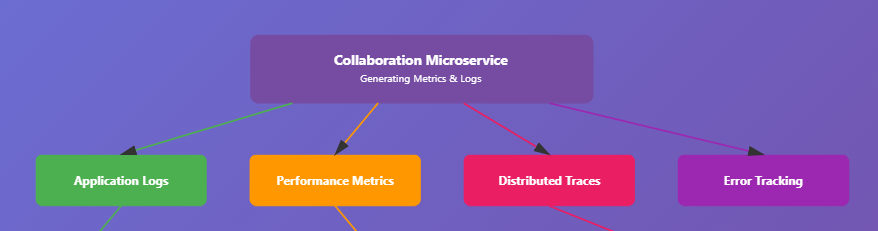

# Collaboration Microservice - Comprehensive Documentation

## Table of Contents
1. [Overview](#overview)
2. [Architecture](#architecture)
3. [Database Schema](#database-schema)
4. [Core Features](#core-features)
5. [Workflow Diagrams](#workflow-diagrams)
6. [API Endpoints](#api-endpoints)
7. [Integration with Main Application](#integration)
8. [Real-time Communication](#real-time-communication)
9. [Deployment](#deployment)
10. [Configuration](#configuration)

## Overview

The Collaboration Microservice is a comprehensive real-time collaboration platform designed for medical professionals, educators, and students. It provides secure, feature-rich virtual rooms for case discussions, teaching sessions, and professional consultations.

### Key Features
- **Real-time Collaboration Rooms** - Virtual spaces for medical discussions
- **WebRTC Video/Audio** - High-quality video conferencing with WebRTC
- **Screen Sharing** - Share medical images, presentations, and documents
- **AI Integration** - Gemini-powered assistant for medical insights
- **User Management** - Role-based access control (Teachers, Doctors, Students, Patients)
- **Notification System** - Real-time and email notifications
- **File Sharing** - Secure medical document exchange
- **Chat System** - Persistent messaging with reactions and threads

## Architecture

### High-Level Architecture Diagram


### Component Architecture

```
collaboration/
│
├── config.py                 [Configuration Management]
│   └── Settings class with environment variables
│
├── integration.py            [Main App Integration]
│   └── CollaborationIntegration class
│
├── service_container.py      [Dependency Injection]
│   └── ServiceContainer for service management
│
├── models/                   [Data Models]
│   ├── models.py            → Core domain models
│   └── extended_models.py   → Extended models for services
│
├── database/                 [Database Layer]
│   ├── database_client.py   → Neo4j client wrapper
│   ├── neo4j_storage.py     → Storage operations
│   └── init_db.py           → Database initialization
│
├── services/                 [Business Logic]
│   ├── room_service.py      → Room management
│   ├── chat_service.py      → Messaging system
│   ├── user_service.py      → User profiles
│   ├── screen_share_service.py → Screen sharing
│   ├── video_service.py     → Video conferencing
│   ├── webrtc_service.py    → WebRTC signaling
│   ├── notification_service.py → Notifications
│   └── ai_integration_service.py → AI assistant
│
├── routes/                   [API Endpoints]
│   ├── room_routes.py       → Room operations
│   ├── chat_routes.py       → Chat operations
│   ├── user_routes.py       → User operations
│   ├── screen_share_routes.py → Screen sharing
│   └── notification_routes.py → Notifications
│
├── websocket/                [Real-time Communication]
│   ├── websocket_manager.py → WebSocket connections
│   ├── chat_handler.py      → Chat events
│   ├── video_handler.py     → Video events
│   └── event_broadcaster.py → Event distribution
│
└── utils/                    [Utilities]
    ├── auth_utils.py        → Authentication helpers
    └── validation_utils.py  → Input validation
```

## Database Schema

### Neo4j Graph Database Schema


## Core Features

### 1. Room Management System


### 2. Screen Sharing Feature


### 3. Real-time Chat System


### 4. WebRTC Video/Audio Communication


### 5. AI Integration System


## Workflow Diagrams

### User Join Request Workflow


### Notification System Workflow


## API Endpoints

### Room Management
```
POST   /api/collaboration/rooms                 - Create room
GET    /api/collaboration/rooms                 - List rooms
GET    /api/collaboration/rooms/{room_id}       - Get room details
PUT    /api/collaboration/rooms/{room_id}       - Update room
DELETE /api/collaboration/rooms/{room_id}       - Delete room
POST   /api/collaboration/rooms/{room_id}/join  - Join room
POST   /api/collaboration/rooms/{room_id}/leave - Leave room
GET    /api/collaboration/rooms/{room_id}/participants - Get participants
```

### Chat Operations
```
POST   /api/collaboration/rooms/{room_id}/messages     - Send message
GET    /api/collaboration/rooms/{room_id}/messages     - Get messages
PUT    /api/collaboration/messages/{message_id}        - Edit message
DELETE /api/collaboration/messages/{message_id}        - Delete message
POST   /api/collaboration/messages/{message_id}/react  - Add reaction
```

### Screen Sharing
```
POST   /api/collaboration/rooms/{room_id}/screen-share/start  - Start sharing
POST   /api/collaboration/rooms/{room_id}/screen-share/stop   - Stop sharing
GET    /api/collaboration/rooms/{room_id}/screen-share/status - Get status
PUT    /api/collaboration/rooms/{room_id}/screen-share/quality - Update quality
```

### WebSocket Events
```
CONNECTION:
ws://localhost:8002/ws/{user_id}

EVENTS:
→ message           - New chat message
→ user_joined       - User joined room
→ user_left         - User left room
→ typing            - Typing indicator
→ screen_share      - Screen share status
→ webrtc_signal     - WebRTC signaling
→ notification      - Real-time notification
```

## Integration with Main Application

### Integration Flow


## Real-time Communication

### WebSocket Architecture


## Configuration

### Environment Variables

```bash
# Service Configuration
COLLABORATION_HOST=0.0.0.0
COLLABORATION_PORT=8002
DEBUG=False
ENVIRONMENT=production

# Database
NEO4J_URI=bolt://localhost:7687
NEO4J_USER=neo4j
NEO4J_PASSWORD=password

# Security
JWT_SECRET_KEY=your-secret-key
JWT_ALGORITHM=HS256

# AI Integration
GEMINI_API_KEY=your-gemini-api-key
AI_MODEL_NAME=gemini-pro

# WebRTC
STUN_SERVERS=stun:stun.l.google.com:19302
TURN_SERVER_URL=turn:your-turn-server.com:3478
TURN_SECRET=your-turn-secret

# Features
ENABLE_SCREEN_SHARING=True
ENABLE_AI_ASSISTANT=True
ENABLE_VIDEO_RECORDING=False
```

### Performance Tuning

```yaml
# Optimization Settings
connection_pool_size: 20
cache_ttl: 3600
rate_limit_requests: 100
rate_limit_period: 60
ws_heartbeat_interval: 30
ws_max_connections: 50
room_max_participants: 20
chat_history_limit: 100
```

## Security Considerations

1. **Authentication**: JWT-based authentication with role-based access control
2. **Data Encryption**: TLS/SSL for all communications
3. **Input Validation**: Comprehensive input sanitization and validation
4. **Rate Limiting**: Protection against DoS attacks
5. **CORS**: Configurable CORS policies
6. **WebRTC Security**: DTLS for media streams, secure signaling

## Monitoring & Logging



KEY METRICS:
• Room creation rate
• Active users count
• Message throughput
• WebRTC connection success rate
• Screen share quality metrics
• AI response latency
• WebSocket connection stability
```
