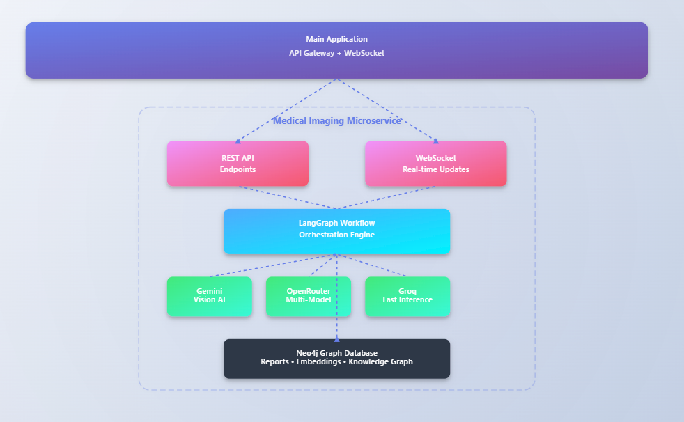
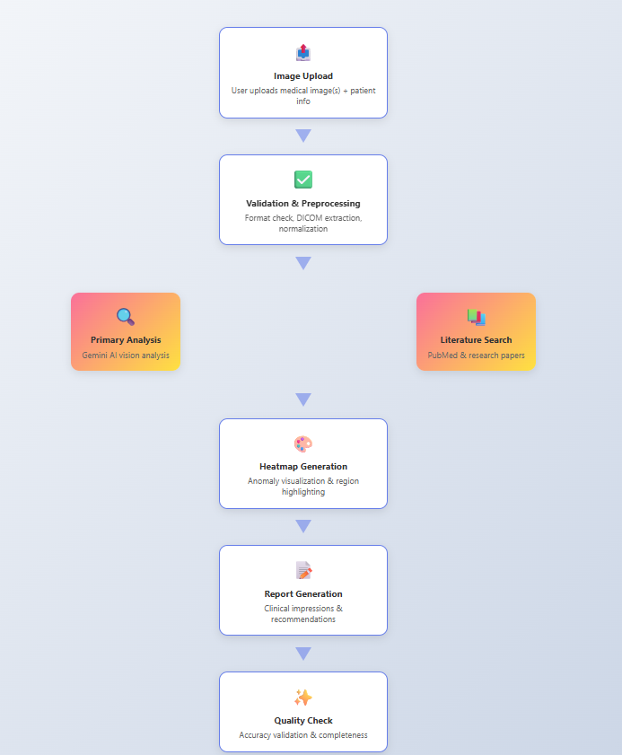
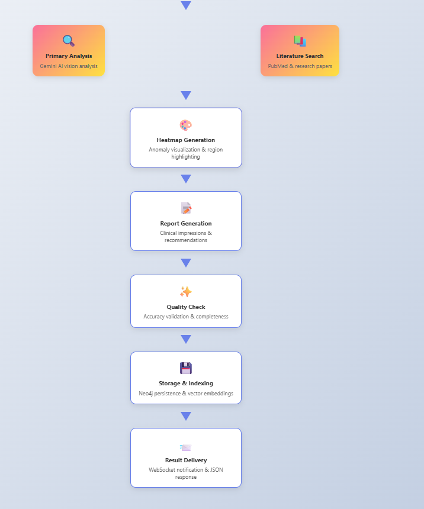
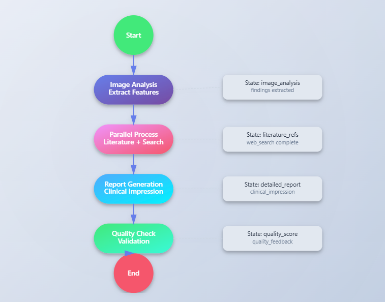
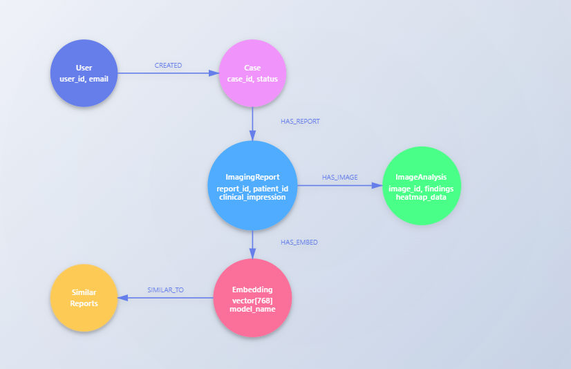
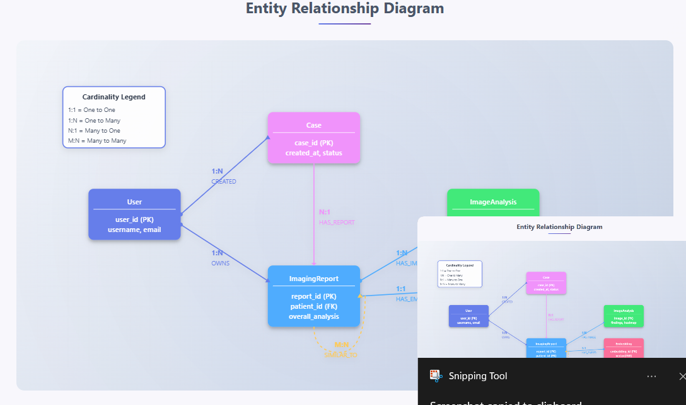
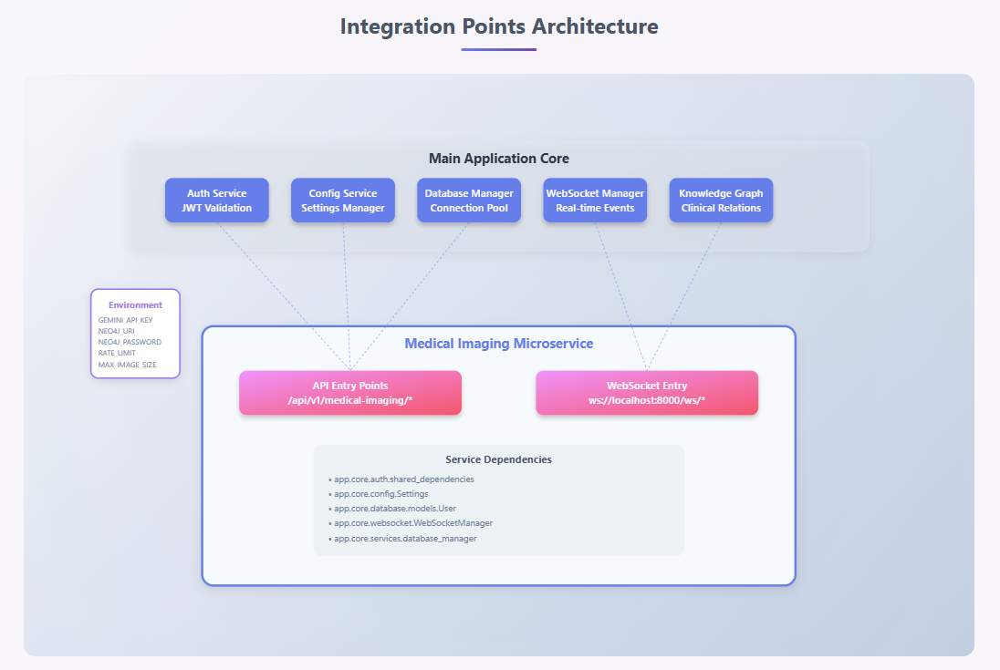

# Medical Imaging Microservice Documentation

## 📋 Table of Contents
- [Overview](#overview)
- [Architecture](#architecture)
- [Core Components](#core-components)
- [Workflow Diagrams](#workflow-diagrams)
- [Database Schema](#database-schema)
- [Integration Points](#integration-points)
- [API Endpoints](#api-endpoints)
- [Technologies Used](#technologies-used)
- [Configuration](#configuration)
- [Performance Metrics](#performance-metrics)

## 🎯 Overview

The Medical Imaging Microservice is a sophisticated AI-powered system designed for comprehensive medical image analysis, report generation, and intelligent diagnosis assistance. It leverages multiple AI providers (Gemini, OpenRouter, Groq) with intelligent fallback mechanisms to ensure high availability and accuracy.

### Key Features
- 🖼️ Multi-modal medical image analysis (CT, MRI, X-Ray, Ultrasound, PET)
- 📊 AI-powered report generation with clinical impressions
- 🔬 Medical literature integration and citation
- 🎨 Heatmap generation for visual anomaly detection
- 🧠 Vector embeddings for semantic search and similar case retrieval
- 🔄 Real-time progress updates via WebSocket
- 💾 Persistent storage in Neo4j graph database
- 🚀 High availability with multi-provider fallback

## 🏗️ Architecture

### High-Level Architecture Diagram


## 🔧 Core Components

### 1. **Workflow Management**
- **LangGraph Orchestration**: State-based workflow management with checkpointing
- **WorkflowManager**: Main orchestrator for end-to-end processing
- **WebSocket Adapter**: Real-time progress communication

### 2. **AI Providers**
- **Gemini Provider**: Primary AI with vision capabilities
- **OpenRouter Provider**: 27+ model fallback options
- **Groq Provider**: Ultra-fast inference for quick analysis
- **Web Search Provider**: Medical literature and research integration

### 3. **Processing Services**
- **Image Processor**: DICOM support, normalization, enhancement
- **Embedding Service**: GloVe embeddings for semantic search
- **Heatmap Generator**: Visual anomaly highlighting

### 4. **Database Services**
- **Neo4j Report Storage**: Persistent report management
- **Neo4j Embedding Storage**: Vector similarity search
- **Knowledge Graph Integration**: Clinical relationship mapping

## 📊 Workflow Diagrams

### Main Processing Workflow





### LangGraph State Flow



## 💾 Database Schema

### Neo4j Graph Database Schema



### Data Model Relationships



## 🔌 Integration Points

### 1. **Main Application Integration**

```yaml
Entry Points:
  - REST API: /api/v1/medical-imaging/*
  - WebSocket: ws://localhost:8000/ws/medical-imaging/{case_id}
  
Authentication:
  - JWT token validation via shared auth module
  - User context from main app's auth system
  
Database:
  - Shared Neo4j instance with main application
  - Unified database manager for connection pooling
  
Configuration:
  - Inherits settings from app.core.config
  - Environment variables from main .env file
```

### 2. **Service Dependencies**

```
Main App Services Used:
├── app.core.auth.shared_dependencies (Authentication)
├── app.core.config.Settings (Configuration)
├── app.core.database.models.User (User Model)
├── app.core.websocket (WebSocket Manager)
├── app.core.knowledge_graph (Knowledge Graph Service)
└── app.core.services.database_manager (DB Connection Pool)
```

### 3. **Communication Flow**


## 🚀 API Endpoints



### REST API Endpoints

| Method | Endpoint | Description |
|--------|----------|-------------|
| POST | `/api/v1/medical-imaging/analyze` | Upload and analyze medical images |
| GET | `/api/v1/medical-imaging/report/{report_id}` | Retrieve specific report |
| GET | `/api/v1/medical-imaging/reports` | List user's reports |
| GET | `/api/v1/medical-imaging/similar/{report_id}` | Find similar cases |
| GET | `/api/v1/medical-imaging/health` | Service health status |
| POST | `/api/v1/medical-imaging/chat/{report_id}` | Interactive report discussion |

### WebSocket Events

| Event | Direction | Description |
|-------|-----------|-------------|
| `connect` | Client → Server | Establish WebSocket connection |
| `progress` | Server → Client | Processing progress updates |
| `result` | Server → Client | Final analysis results |
| `error` | Server → Client | Error notifications |
| `disconnect` | Client → Server | Close connection |

## 🛠️ Technologies Used

### Core Technologies
- **Python 3.9+**: Primary language
- **FastAPI**: Web framework and API
- **LangGraph**: Workflow orchestration
- **Neo4j**: Graph database
- **WebSocket**: Real-time communication

### AI/ML Stack
- **Google Gemini**: Primary vision AI
- **OpenRouter**: Multi-model gateway
- **Groq**: Fast inference
- **GloVe**: Text embeddings
- **NumPy/Pillow**: Image processing

### Supporting Libraries
- **Pydantic**: Data validation
- **AsyncIO**: Asynchronous processing
- **JWT**: Authentication
- **Logging**: Comprehensive logging

## ⚙️ Configuration

### Environment Variables

```bash
# AI Provider Keys
GEMINI_API_KEY=your-gemini-key
OPENROUTER_API_KEY=your-openrouter-key
GROQ_API_KEY=your-groq-key

# Database Configuration
NEO4J_URI=bolt://localhost:7687
NEO4J_USER=neo4j
NEO4J_PASSWORD=your-password

# Service Configuration
MEDICAL_IMAGING_PORT=8001
WEBSOCKET_TIMEOUT=300
MAX_IMAGE_SIZE_MB=50
CACHE_TTL_MINUTES=30

# Rate Limiting
RATE_LIMIT_REQUESTS_PER_MINUTE=20
MAX_RETRIES=3
```

### Service Initialization

```python
# In main application startup
from app.microservices.medical_imaging import initialize_medical_imaging

# Initialize during app startup
initialize_medical_imaging()
```

## 📈 Performance Metrics

### Response Times
| Operation | Average Time | 95th Percentile |
|-----------|--------------|-----------------|
| Image Analysis | 3-5 seconds | 8 seconds |
| Report Generation | 5-8 seconds | 12 seconds |
| Embedding Creation | 1-2 seconds | 3 seconds |
| Similar Case Search | 500ms | 1 second |

### Success Rates
| Provider | Success Rate | Fallback Rate |
|----------|--------------|---------------|
| Gemini | 85% | 15% |
| OpenRouter | 90% | 10% |
| Groq | 95% | 5% |
| Combined | 98%+ | N/A |

### Capacity
- **Concurrent Requests**: 50
- **Max Image Size**: 50MB
- **Images per Request**: 10
- **Cache Hit Rate**: 40-60%

## 🔍 Monitoring & Observability

### Health Checks
- Provider availability monitoring
- Database connection health
- Memory and CPU usage tracking
- Request/response time metrics

### Logging
- Structured JSON logging
- Log levels: DEBUG, INFO, WARNING, ERROR
- Correlation IDs for request tracking
- Performance metrics logging

### Error Handling
- Comprehensive error classification
- Provider-specific recovery strategies
- Circuit breaker pattern implementation
- Graceful degradation on failures

## 🚦 Development Guidelines

### Code Structure
```
medical_imaging/
├── agents/          # AI agent configurations
├── langgraph/       # Workflow orchestration
├── models/          # Data models
├── services/        # Business logic
├── workflows/       # High-level workflows
├── tools/           # Utility functions
└── tests/           # Unit and integration tests
```

### Best Practices
1. Always use async/await for I/O operations
2. Implement proper error handling and logging
3. Use dependency injection for services
4. Follow PEP 8 style guidelines
5. Write comprehensive docstrings
6. Maintain test coverage above 80%

## 📝 License

This microservice is part of the Unified Medical AI system and follows the same licensing terms as the parent application.

## 🤝 Support

For issues, questions, or contributions related to this microservice:
- Create an issue in the main repository
- Contact the development team
- Refer to the main application documentation

---
*Last Updated: January 2025*
*Version: 1.0.0*