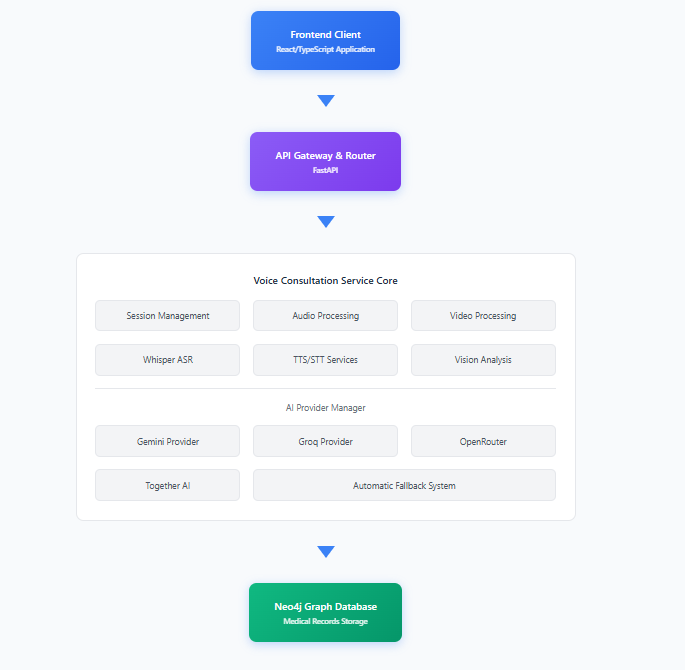
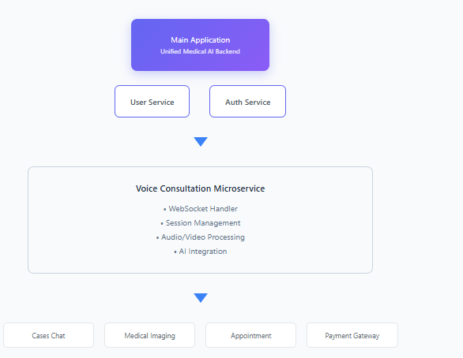
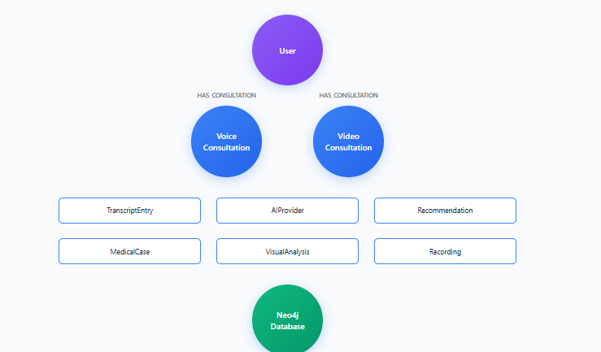
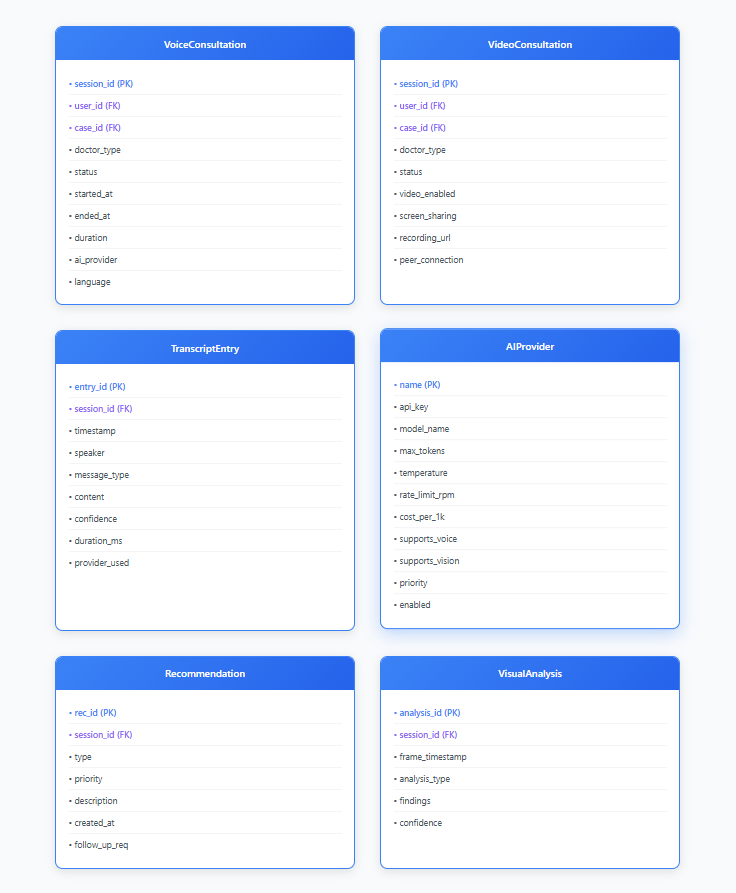
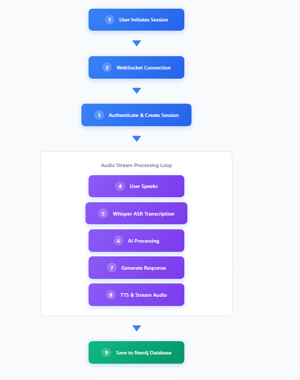
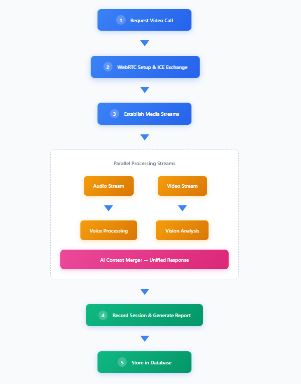
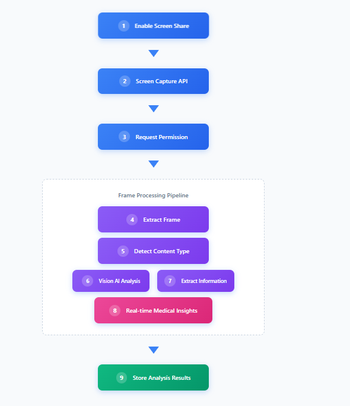

# Voice Consultation Microservice 🎤 
## Status: In Progress 🚧

A comprehensive real-time voice and video consultation microservice with multimodal AI capabilities, WebSocket communication, and medical compliance features.

---

## Table of Contents
- [Overview](#overview)
- [Architecture](#architecture)
- [Database Schema](#database-schema)
- [Workflows](#workflows)
  - [Voice Consultation Workflow](#voice-consultation-workflow)
  - [Video Consultation Workflow](#video-consultation-workflow)
  - [Screen Sharing Workflow](#screen-sharing-workflow)
- [Key Features](#key-features)
- [Technology Stack](#technology-stack)
- [API Integration](#api-integration)
- [Security & Compliance](#security--compliance)
- [Installation & Setup](#installation--setup)

---

## Overview

The Voice Consultation microservice provides real-time medical consultation capabilities through voice, video, and screen sharing modalities. It integrates multiple AI providers with intelligent fallback mechanisms, ensuring high availability and medical-grade reliability.

### Core Capabilities
- **Real-time Voice Consultation** with Whisper ASR transcription
- **Video Consultation** with visual analysis capabilities
- **Screen Sharing** for medical report/scan review
- **Multi-Provider AI Integration** with automatic fallback
- **WebSocket-based Real-time Communication**
- **Medical Compliance & Audit Logging**
- **Comprehensive Session Management**

---

## Architecture

### High-Level System Architecture



### Component Interaction Diagram



---

## Database Schema

### Neo4j Graph Database Schema



### Entity Relationship Diagram



---

## Workflows

### Voice Consultation Workflow



### Video Consultation Workflow



### Screen Sharing Workflow



---

## Key Features

### 🎯 Core Features (Completed)
- ✅ **Real-time Voice Consultation** - WebSocket-based bidirectional communication
- ✅ **Whisper ASR Integration** - High-accuracy speech-to-text transcription
- ✅ **Multi-Provider AI Support** - Gemini, Groq, OpenRouter with fallback
- ✅ **Text-to-Speech** - Natural voice responses using pyttsx3
- ✅ **Session Management** - Complete lifecycle management
- ✅ **Database Integration** - Neo4j graph database with medical compliance
- ✅ **WebSocket Authentication** - JWT-based secure connections
- ✅ **Transcript Storage** - Comprehensive conversation history

### 🚧 In Progress Features
- ⏳ **Video Consultation** - WebRTC implementation in progress
- ⏳ **Screen Sharing** - Medical document/scan sharing capability
- ⏳ **Visual Analysis** - Real-time image analysis for medical context
- ⏳ **Recording Capability** - Session recording for compliance
- ⏳ **Advanced Voice Activity Detection** - Improved speech detection

### 📋 Planned Features
- 📝 **Multi-language Support** - Internationalization
- 📝 **Appointment Integration** - Schedule follow-ups
- 📝 **Prescription Generation** - AI-assisted prescriptions
- 📝 **Medical Report Integration** - Direct report access

---

## Technology Stack

### Backend Technologies
- **Framework**: FastAPI (Async Python)
- **WebSocket**: Native FastAPI WebSocket support
- **Database**: Neo4j Graph Database
- **Speech Recognition**: OpenAI Whisper
- **TTS Engine**: pyttsx3
- **AI Providers**: 
  - Google Gemini (Primary)
  - Groq (Fast inference)
  - OpenRouter (Model variety)

### Communication Protocols
- **Real-time**: WebSocket (WSS)
- **REST API**: FastAPI routes
- **WebRTC**: For video/screen sharing (planned)

### Security & Compliance
- **Authentication**: JWT tokens
- **Encryption**: TLS/SSL for all communications
- **Audit Logging**: Comprehensive activity tracking
- **HIPAA Compliance**: Medical data protection measures

---

## API Integration

### Main Application Integration Points

```python
# Integration with Main App
from app.microservices.voice_consultation import (
    voice_consultation_routes,
    voice_websocket_routes,
    voice_consultation_service
)

# Register routes in main app
app.include_router(
    voice_consultation_routes.router,
    prefix="/api/v1/voice",
    tags=["voice-consultation"]
)

# WebSocket endpoints
app.include_router(
    voice_websocket_routes.router,
    prefix="/ws/voice",
    tags=["voice-websocket"]
)
```

### Key API Endpoints

```yaml
REST Endpoints:
  - POST   /api/v1/voice/consultation/start
  - GET    /api/v1/voice/consultation/{session_id}
  - POST   /api/v1/voice/consultation/{session_id}/end
  - GET    /api/v1/voice/consultation/{session_id}/transcript
  - GET    /api/v1/voice/providers/status

WebSocket Endpoints:
  - WS     /ws/voice/consultation/{session_id}
  - WS     /ws/voice/video/{session_id}
```

---

## Security & Compliance

### Medical Compliance Features
- **HIPAA Compliance**: Encrypted data storage and transmission
- **Audit Logging**: Complete activity tracking
- **Session Recording**: Optional recording for compliance
- **Data Retention**: Configurable retention policies
- **Access Control**: Role-based permissions

### Security Measures
- **JWT Authentication**: Secure token-based auth
- **Rate Limiting**: Provider-level rate limits
- **Input Validation**: Pydantic models for all inputs
- **Error Handling**: Graceful error recovery
- **Monitoring**: Real-time health checks

---

## Installation & Setup

### Prerequisites
```bash
# Python 3.9+
# Neo4j Database
# FFmpeg (for audio processing)
# API Keys for AI providers
```

### Environment Variables
```env
# AI Provider Keys
GEMINI_API_KEY=your_gemini_key
GROQ_API_KEY=your_groq_key
OPENROUTER_API_KEY=your_openrouter_key

# Database
NEO4J_URI=bolt://localhost:7687
NEO4J_USER=neo4j
NEO4J_PASSWORD=password

# WebSocket
WS_AUTH_REQUIRED=true
JWT_SECRET_KEY=your_secret_key
```

### Installation Steps
```bash
# Install dependencies
pip install -r requirements.txt

# Run migrations
python migrations/voice_consultation_migration.py

# Start the service
uvicorn app.main:app --reload --port 8000
```

---

## Contributing

This microservice is currently **in progress**. Contributions are welcome for:
- Completing video consultation features
- Implementing screen sharing
- Improving voice activity detection
- Adding multi-language support

---

## License

Part of the Unified Medical AI Backend system. All rights reserved.

---

## Contact & Support

For issues, questions, or contributions, please contact the development team or raise an issue in the repository.

---

*Last Updated: January 2025*
*Status: In Active Development* 🚧